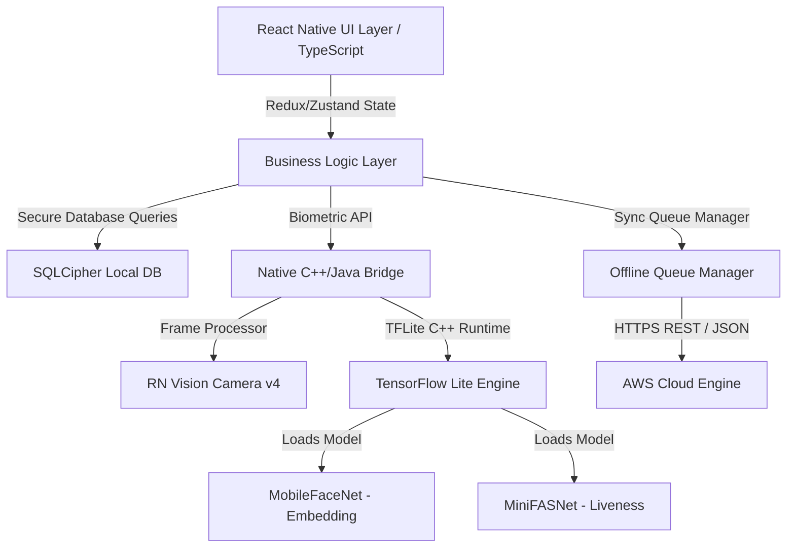

# NHAI Satyapan - Architecture Specification Notes

This document provides the high-level and component-level systems architecture design for the **Secure Edge-AI Biometric Verification Engine**.

---

## 🏛️ System Overview

NHAI Satyapan is structured as a React Native application leveraging native C++/Java modules for performance-critical tasks (such as camera frame processing and TensorFlow Lite inference) while keeping business logic and UI in TypeScript.

---

## 💾 Offline-First & Storage Architecture

### Local Database (SQLite + SQLCipher)
To operate in remote toll plazas and highway corridors with poor or zero network connectivity, the device maintains a complete local replica of worker metadata and facial templates.

*   **Encryption:** The database file is fully encrypted using **SQLCipher (AES-256-CBC)**.
*   **Key Derivation:** The database key is derived using PBKDF2 with 256,000 iterations.
*   **Device Key Protection:** The raw passphrase is never hardcoded. It is generated cryptographically on the first run, encrypted using an RSA/AES key stored securely inside the **Android Keystore System** (hardware-backed: StrongBox or TEE), and decrypted in memory only when opening the database.

### Synchronization Queue
All on-device biometric verifications, enrollments, and status updates are logged into a local transaction queue table (`sync_queue`).

1.  **Queue Schema:**
    *   `id` (UUID Primary Key)
    *   `payload_type` (e.g., `VERIFICATION_AUDIT`, `NEW_ENROLLMENT`)
    *   `payload` (JSON Blob - encrypted)
    *   `timestamp` (ISO 8601 UTC)
    *   `retry_count` (Integer)
    *   `status` (Pending, In-Progress, Failed)
2.  **Sync Engine Workflow:**
    *   A background sync scheduler monitors network availability using `NetInfo`.
    *   When connectivity is restored, the queue reads records sequentially (FIFO) and dispatches them via authenticated HTTPS calls to AWS API Gateway.
    *   Upon successful response (HTTP 200/201), the queue record is deleted.
    *   If transmission fails due to network drop, the sync pauses and schedules a retry with exponential backoff.

---

## 🧠 Edge-AI Biometric Pipeline

Biometric verification must be executed 100% on-device on the highway edge.

### 1. Pre-processing & Camera Bridge
*   Using `react-native-vision-camera`, custom C++ frame processors hook directly into the Android CameraX stream.
*   Frames are processed in real-time. To prevent UI threads from locking, frames are scaled and converted on a background thread (`ai-inference` thread).

### 2. Liveness Detection (MiniFASNet)
*   **Model:** Quantized MiniFASNet (Mini Face Anti-Spoofing Network).
*   **Purpose:** Rejects dynamic video replays, high-resolution prints, and 3D mask presentation attacks.
*   **Pipeline Stage:** Before face verification is attempted, the crop is passed to the liveness model.
*   **Output:** Returns a probability score $[0, 1]$ representing the likelihood of the face being real (live). If the score falls below a pre-configured security threshold (e.g., $0.85$), the verification fails immediately with a "Presentation Attack Detected" warning.

### 3. Face Verification (MobileFaceNet)
*   **Model:** INT8 Quantized MobileFaceNet.
*   **Input:** Normalized, aligned $112 \times 112 \times 3$ RGB crop of the face.
*   **Output:** 128-dimensional floating point vector (face embedding).
*   **On-Device Matching:** The extracted vector is compared with the target employee's embedding stored in SQLCipher using on-device **Cosine Similarity**:
    $$\text{Similarity} = \frac{A \cdot B}{\|A\| \|B\|}$$
    If Similarity $\ge 0.72$ (configurable FAR target $10^{-4}$), verification is declared successful.

---

## ☁️ AWS Cloud Synchronization Engine

The cloud backend serves as the source of truth and administrative portal.

*   **AWS Cognito:** Manages secure device provisioning. Each NHAI field tablet is registered and assigned an IAM role with limited permissions to upload sync payloads.
*   **API Gateway & AWS Lambda:** Processes incoming JSON sync records.
*   **Amazon DynamoDB:** Stores global personnel metadata and verification audit logs.
*   **Amazon S3:** Stores encrypted audit photos (uploaded only in critical validation failure cases or random audit intervals).
*   **Model Distribution:** Updated TFLite models are uploaded by data scientists to S3. Mobile devices query a manifest API and download new models over Wi-Fi when available, verifying file integrity with SHA-256 checksums before loading.

---

## 🏛️ Government UI/UX Design Principles

To cater to remote and diverse field operators, the user interface must be accessible and robust.

1.  **High Contrast & Outdoor Visibility:** Dark Mode/Light Mode optimized for sunlight readability. Uses bold typography (Inter/Outfit) and high contrast warning indicators.
2.  **Multilingual Setup:**
    *   Bilingual-first (English & Hindi) by default.
    *   Scalable structure for regional languages (e.g., Telugu, Tamil, Marathi).
3.  **Low-literacy Assistive Cues:**
    *   Haptic feedback patterns for Success (double short vibration) and Failure (long pulse).
    *   Vocal assistance prompts (e.g., Text-to-Speech speaking instructions like *"Apna chehra camera ke samne laye"*).
    *   Color-coded bounding box overlays around the face:
        *   **Yellow:** Aligning/No face.
        *   **Green:** Live face found, verifying.
        *   **Red:** Verification rejected / Spoof detected.
