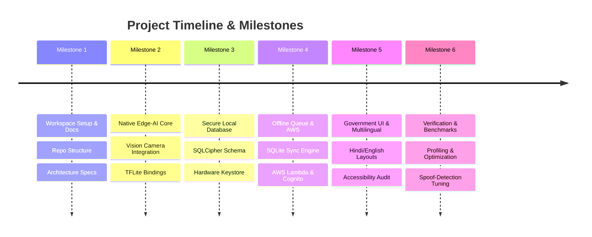

# NHAI Satyapan - Project Roadmap

This roadmap details the engineering phases for the implementation of the **Secure Edge-AI Biometric Verification Engine** for the NHAI Satyapan hackathon.

---

## 🎯 High-Level Milestones

---

## 📅 Detailed Phases & Tasks

### 📍 Milestone 1: Workspace Setup & Architecture Definition
*   **Target Date:** Day 1 (May 25, 2026)
*   **Status:** [x] Completed
*   **Key Deliverables:**
    *   [x] Standardized project folder structure.
    *   [x] Main workspace `README.md` and basic Git configuration.
    *   [x] Architectural specification notes (`architecture-notes.md`).
    *   [x] Benchmarking objectives (`benchmark-targets.md`).
    *   [x] Daily development log (`daily-progress.md`).

### 📍 Milestone 2: Native Edge-AI Core Integration
*   **Target Date:** Days 2-3
*   **Status:** [ ] Pending
*   **Key Deliverables:**
    *   [ ] Initialize React Native CLI + TypeScript inside `/app`.
    *   [ ] Integrate `react-native-vision-camera` (v4) and verify Android CameraX bindings.
    *   [ ] Set up TensorFlow Lite (TFLite) C++ / Java bindings for Android.
    *   [ ] Implement a custom Frame Processor to convert camera YUV buffers to RGB bitmaps.
    *   [ ] Deploy Face Detection (SSD / BlazeFace) to extract regions of interest (ROI).
    *   [ ] Integrate **MobileFaceNet** for 128-dimensional face embedding extraction.
    *   [ ] Integrate **MiniFASNet** for liveness detection (anti-spoofing).

### 📍 Milestone 3: Encrypted Database & Device Security
*   **Target Date:** Day 4
*   **Status:** [ ] Pending
*   **Key Deliverables:**
    *   [ ] Integrate `react-native-quick-sqlite` or custom SQLite bindings configured with **SQLCipher**.
    *   [ ] Write native code for secure database key derivation using **Android Keystore** (AES-GCM key wrapping).
    *   [ ] Define SQL database schema for local users, templates, verification logs, and synchronization queue.
    *   [ ] Implement database utility classes for biometric template comparison (Cosine Similarity and Euclidean Distance on-device queries).

### 📍 Milestone 4: Offline Queue & AWS Synchronizer
*   **Target Date:** Days 5-6
*   **Status:** [ ] Pending
*   **Key Deliverables:**
    *   [ ] Build a custom local offline synchronization queue in SQLite.
    *   [ ] Create a background scheduler (using `react-native-background-fetch` or work manager) to monitor connectivity.
    *   [ ] Set up AWS Cognito for device enrollment and credentials provisioning.
    *   [ ] Implement AWS SDK bindings / REST client to sync local logs with Amazon S3 (for image logs) and DynamoDB (for audit records).
    *   [ ] Implement conflict resolution rules (device-wins vs. server-wins) for offline personnel modification.

### 📍 Milestone 5: Government-Grade UI/UX & Localization
*   **Target Date:** Day 7
*   **Status:** [ ] Pending
*   **Key Deliverables:**
    *   [ ] Develop an intuitive dashboard using NHAI branding colors (Navy Blue, Saffron, and White).
    *   [ ] Build an immersive Camera view with dynamic guidance HUD (e.g., "Move Closer", "Blink", "Ensure Good Lighting").
    *   [ ] Implement localization framework supporting English, Hindi, and regional languages.
    *   [ ] Conduct Accessibility audit (WCAG 2.1 AA compliance, screen-reader support, dynamic text scaling).

### 📍 Milestone 6: Benchmarking, Optimization, & Hardening
*   **Target Date:** Day 8 (Submission Readiness)
*   **Status:** [ ] Pending
*   **Key Deliverables:**
    *   [ ] Quantize AI models to INT8 using TensorFlow Lite Model Optimization Toolkit.
    *   [ ] Profile and optimize CPU, RAM, and battery utilization during continuous camera stream.
    *   [ ] Benchmark embedding search latency under SQLite encryption.
    *   [ ] Prepare the final presentation, pdf architectural charts, and recorded system demonstration.

---

## ⚠️ Risk Management & Mitigation

| Risk | Impact | Likelihood | Mitigation Strategy |
| :--- | :--- | :--- | :--- |
| **High Camera Latency** | High | Medium | Implement Frame skipping (e.g., process 1 out of every 3 frames) and run inference on a dedicated background thread. |
| **Model Size Exceeding Limit** | Medium | Medium | Apply INT8 post-training quantization to reduce weights from FP32 (4x size reduction) and bundle models dynamic-load from local storage. |
| **Biometric Database Compromise** | Critical | Low | Encrypt entire DB with SQLCipher. Derivate encryption keys inside Android Keystore. Never store raw images; store only embeddings. |
| **Sync Failures / Data Conflicts** | High | High | Implement transaction-backed sync queue. Use idempotency keys for all AWS Lambda sync payloads. |
